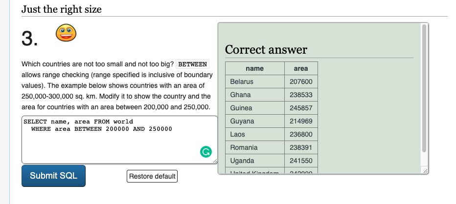
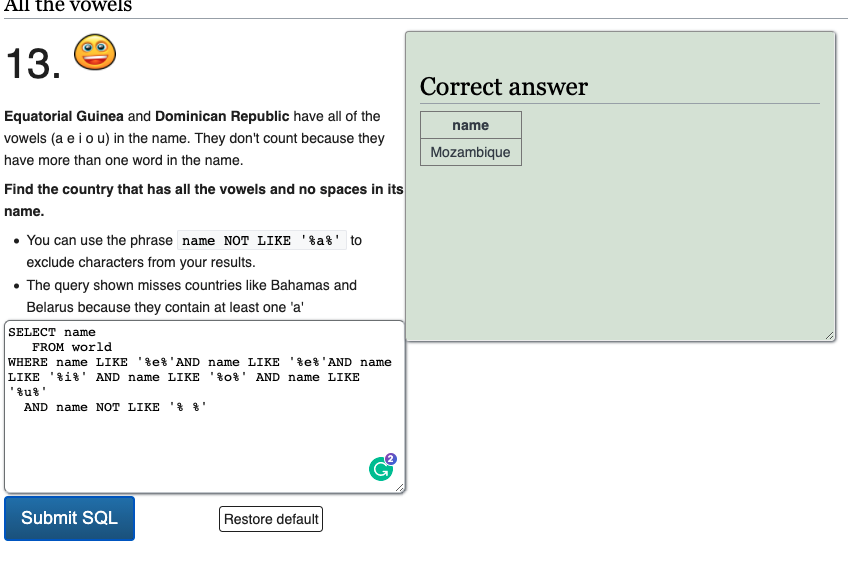
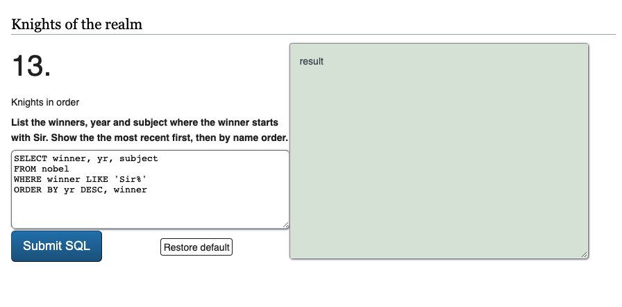
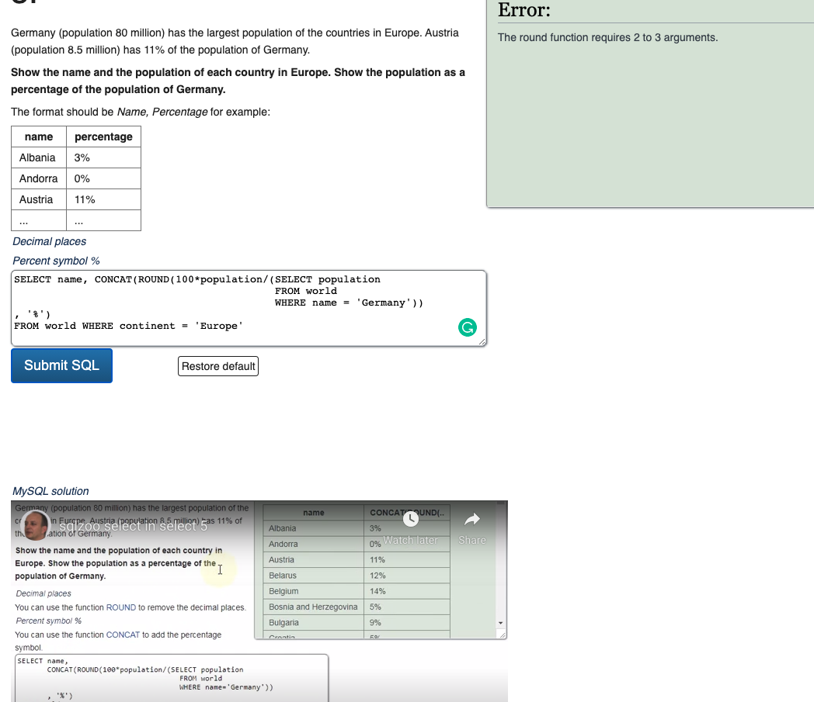
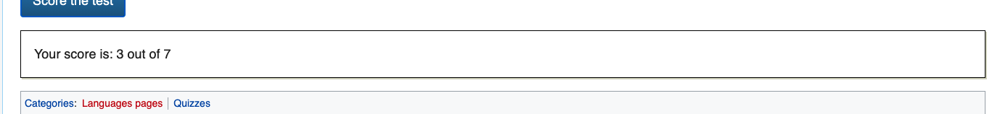

# The wonderful world of sqlzoo
https://sqlzoo.net/ is a great resource for learning sql in a rapid-feedback environment. You will be going on a guided tour of it! 

### Getting started, and eventually, turning it in
Fork and clone this repo. Your deliverable will be a screenshot of the last question you got to, similarly to when we did CSS games. Put the screenshot into this folder, and add-commit-push it just like any other file.

### Some general notes about sqlzoo:
1. Each segment has a tutorial followed by a quiz.
1. We will not be doing all segments, and we will be skipping some questions within certain segments. Pay attention to the guided walkthrough!
1. Many questions have a link to helpful information, or a video that explains the solution. You should look at these before attempting the questions!
1. On every tutorial, you can append `?answers=true` onto the end of the url to see the answers. This is a helpful resource when you're completely stuck, but if you use it to turn this interactive learning experience into a read-along, you're not going to retain much!

### The segments:
Segments 1 - 5 will make you a champion at SELECT basics by giving you a lot of repetitions.
1. [`https://sqlzoo.net/wiki/SELECT_basics`](https://sqlzoo.net/wiki/SELECT_basics)

2. [`https://sqlzoo.net/wiki/SELECT_Quiz`](https://sqlzoo.net/wiki/SELECT_Quiz)

3. [`https://sqlzoo.net/wiki/SELECT_from_WORLD_Tutorial`](https://sqlzoo.net/wiki/SELECT_from_WORLD_Tutorial)
There seems to be a glitch on question 11. The cheat mode answer wasn't marked as correct either.

4. [`https://sqlzoo.net/wiki/BBC_QUIZ`](https://sqlzoo.net/wiki/BBC_QUIZ)

5. [`https://sqlzoo.net/wiki/SELECT_from_Nobel_Tutorial`](https://sqlzoo.net/wiki/SELECT_from_Nobel_Tutorial)
There seems to be a glitch on question 14. The cheat mode answer wasn't marked as correct either.

Segment 6 is somewhat out of order. It relies on aggregates and nested queries, which are covered in segments 7 - 10. You can come back and do this quiz after finishing segement 10.

6. [`https://sqlzoo.net/wiki/Nobel_Quiz`](https://sqlzoo.net/wiki/Nobel_Quiz)

Do segment 7 only up through question 5. As the site says, the rest of the questions are more than we need.
7. [`https://sqlzoo.net/wiki/SELECT_within_SELECT_Tutorial`](https://sqlzoo.net/wiki/SELECT_within_SELECT_Tutorial)
On number five, the solution from the tuturial video didn't work, but the one from the cheatsheet did (attached picture shows the tutorial solution)

For segment 8, only do questions number 4, 5, and 6.

8. [`https://sqlzoo.net/wiki/Nested_SELECT_Quiz`](https://sqlzoo.net/wiki/Nested_SELECT_Quiz)
For questions 4, 5, and 6

9. [`https://sqlzoo.net/wiki/SUM_and_COUNT`](https://sqlzoo.net/wiki/SUM_and_COUNT)

10. [`https://sqlzoo.net/wiki/SUM_and_COUNT_Quiz`](https://sqlzoo.net/wiki/SUM_and_COUNT_Quiz)
11. [`https://sqlzoo.net/wiki/The_JOIN_operation`](https://sqlzoo.net/wiki/The_JOIN_operation)
12. [`https://sqlzoo.net/wiki/JOIN_Quiz`](https://sqlzoo.net/wiki/JOIN_Quiz)
13. [`https://sqlzoo.net/wiki/More_JOIN_operations`](https://sqlzoo.net/wiki/More_JOIN_operations)
14. [`https://sqlzoo.net/wiki/JOIN_Quiz_2`](https://sqlzoo.net/wiki/JOIN_Quiz_2)
